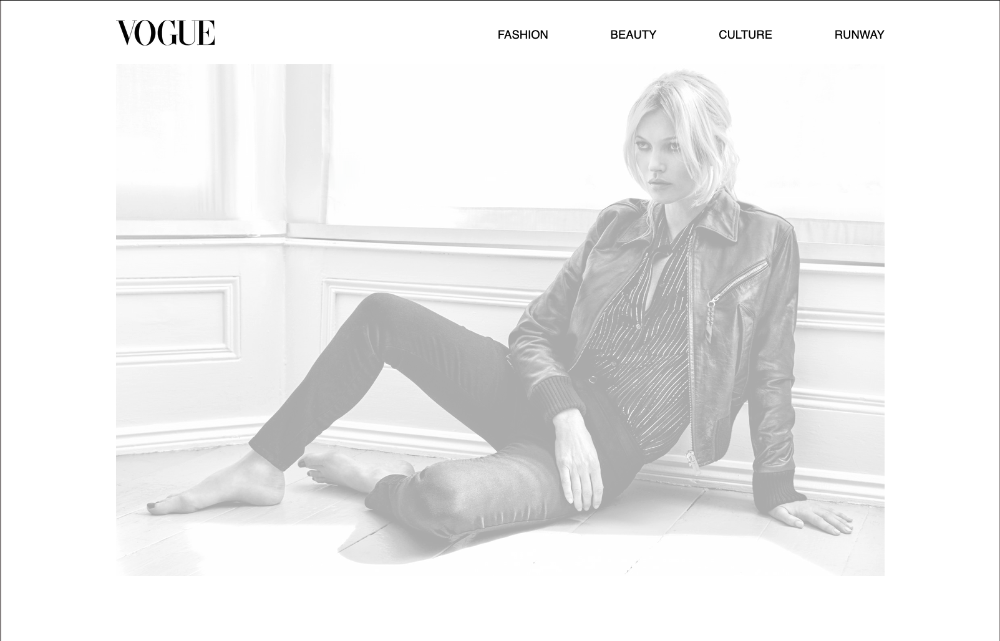

 

# News Site

Vogue Site is a project that is focusing on responsive design and the layout techniques of CSS Grid and Flexbox.

## The problem

Describe how you approached to problem, and what tools and techniques you used to solve it. How did you plan? What technologies did you use? If you had more time, what would be next?

## View it live

[Vogue Magazine](https://project-technigo-news-site.netlify.app)
